# ORB-TAMA — a pocket tamagotchi for the ESP32-C3 round display

A self-contained virtual pet for the **JCZN/Guition ESP32-2424S012** board
(ESP32-C3 + 1.28″ round 240×240 GC9A01 IPS + CST816D touchscreen).
No buttons, no wires, no cloud — everything happens on the round glass.

Board reference: [JCZN ESP32-2424S012](https://homeding.github.io/boards/esp32c3/jczn-esp32-2424s012.htm)

## Screenshots

*Rendered by `tools/orb_render.py` from the exact drawing calls in
`orb.ino` (same colors, coordinates, and the bundled FreeSansBold bitmap
fonts), so they faithfully match what the 240×240 round screen shows.*

| Happy adult | Baby | Teen (curious) | Zoomies |
|---|---|---|---|
| 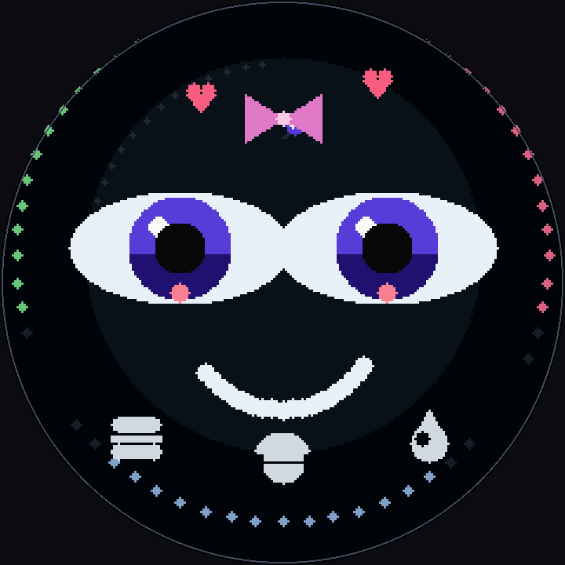 | 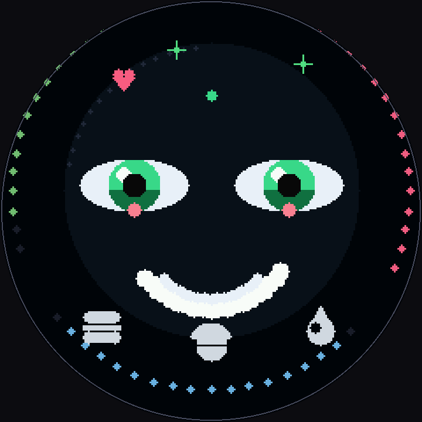 | 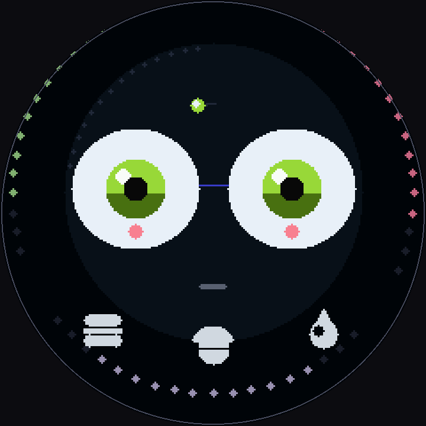 | 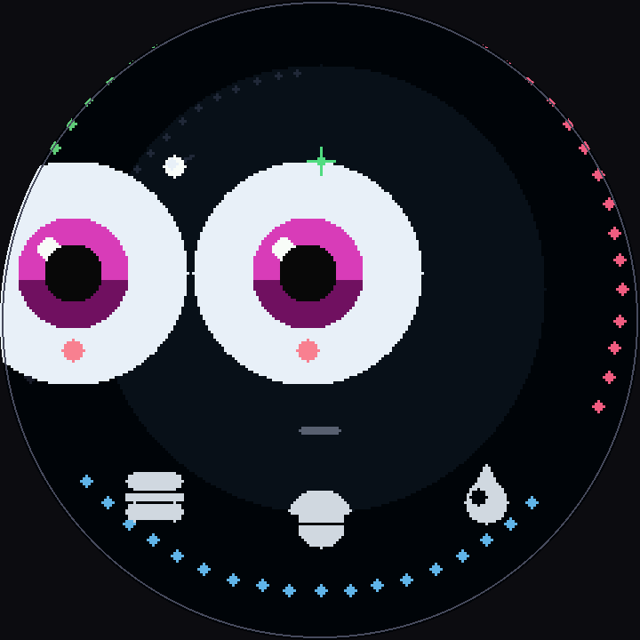 |

| Sleepy | Sleeping | Angry | Sad |
|---|---|---|---|
| 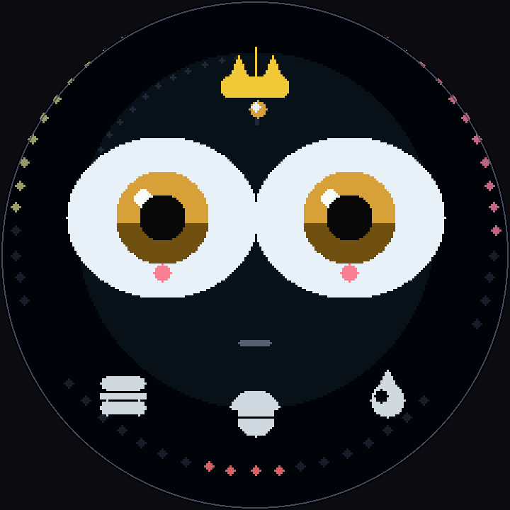 | 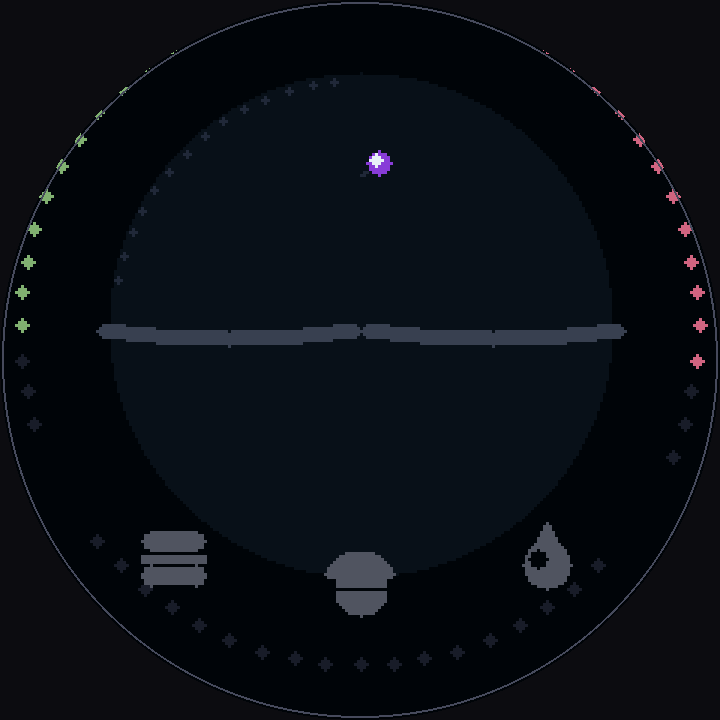 | 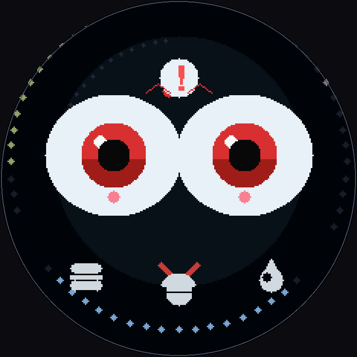 | 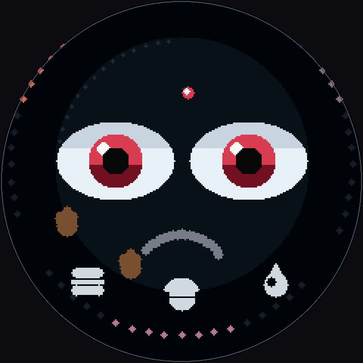 |

| Stats panel (adult) | Stats panel (teen) | Food chooser | Game chooser |
|---|---|---|---|
| 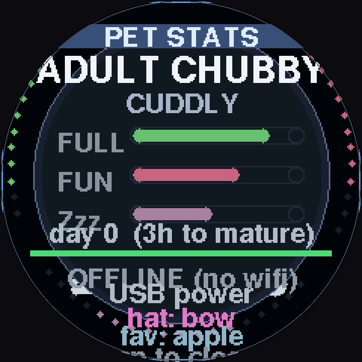 | 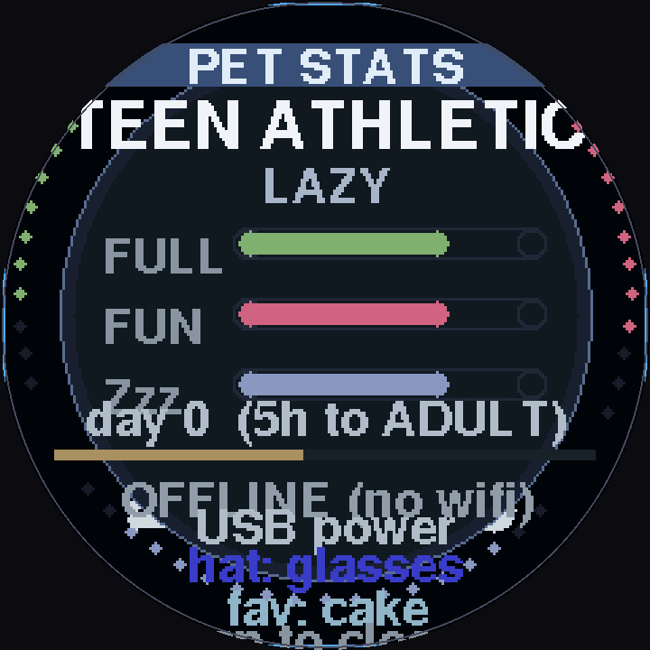 | 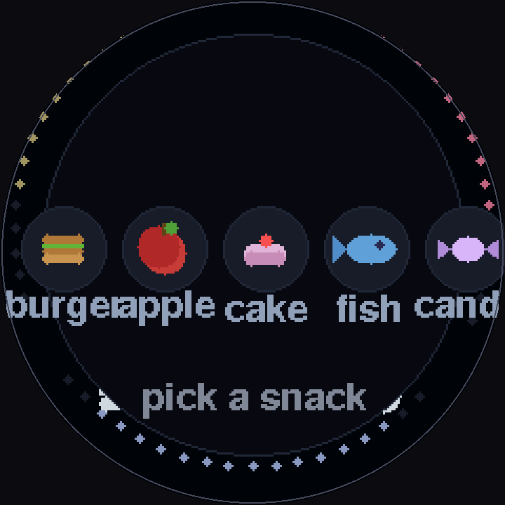 | 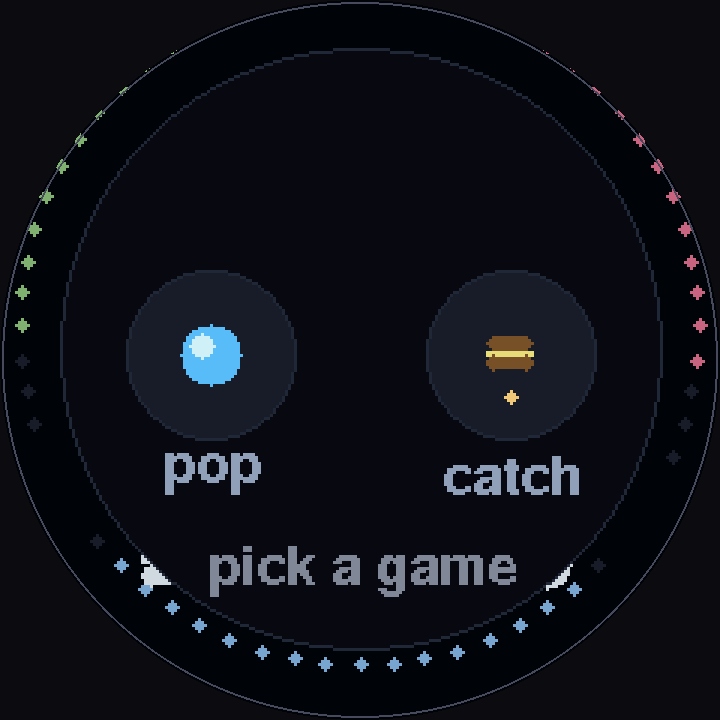 |

| Pop game | Catch game | Night clock | Egg -> hatch | R.I.P. |
|---|---|---|---|---|
| 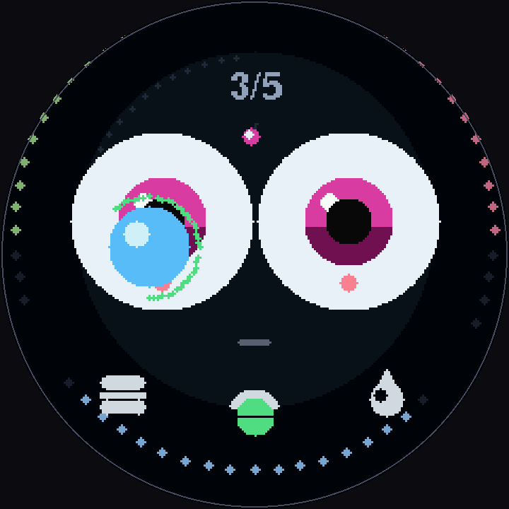 | 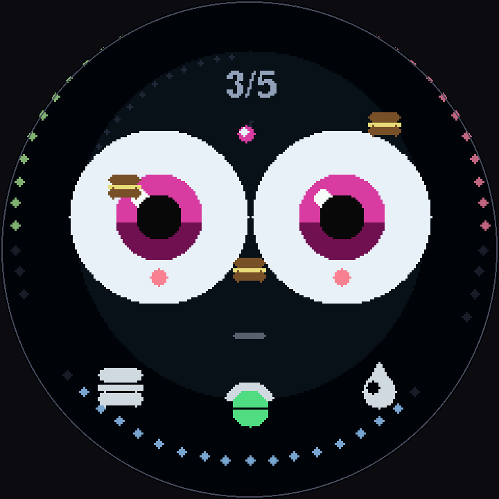 | 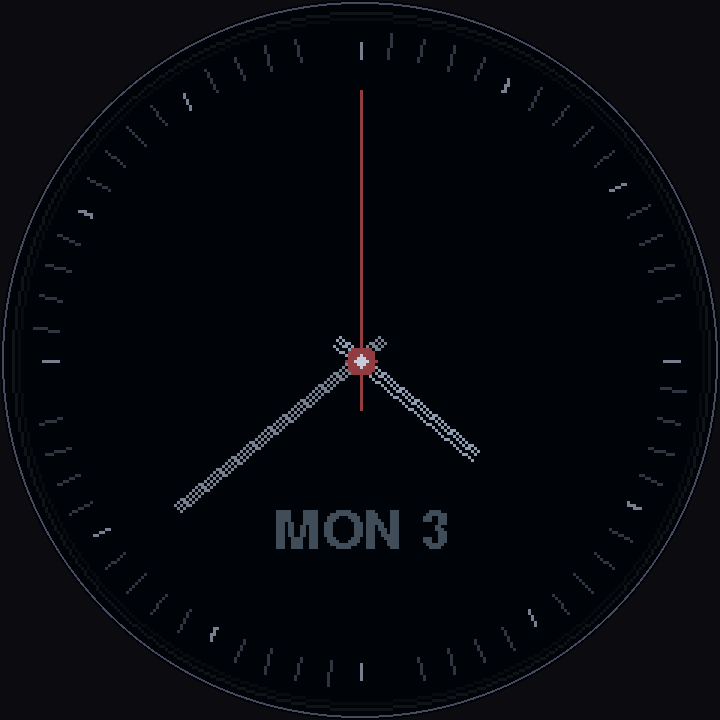 | 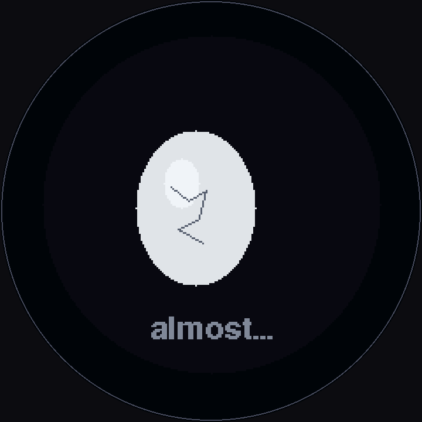 | 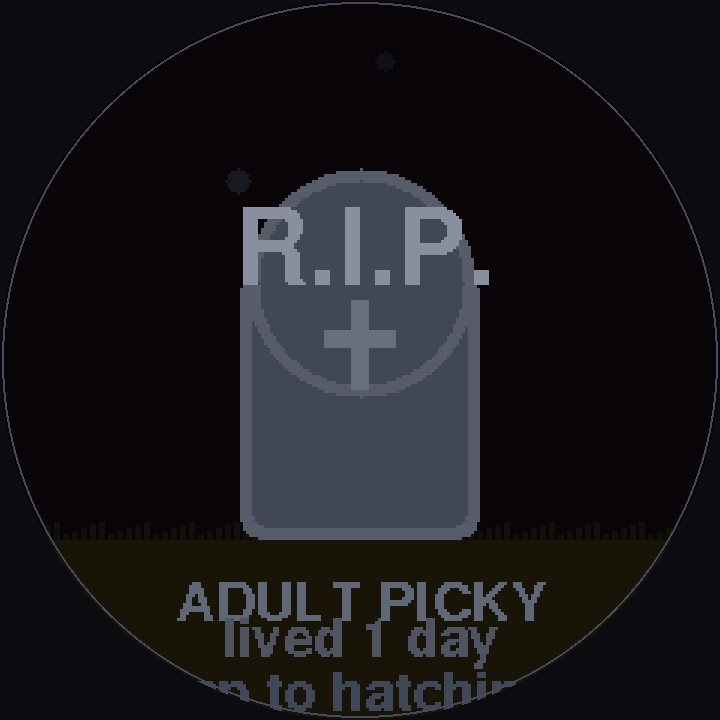 |

Regenerate with:

```bash
python3 tools/orb_render.py screenshots
```

Raw 240×240 frames (without the bezel) are saved alongside as `*.png`.

## What it does

The Orb hatches from an egg after 5 minutes (progressive wobble + cracks),
then lives on your desk with a **personality** (lazy / hyper / picky /
cuddly — affects how fast it gets hungry/bored/tired and how much petting
helps), then lives on your desk:

| Interaction | What happens |
|---|---|
| **Drag** your finger over it | Petting — hearts float up, +fun |
| **Tap** it | It giggles / waves, +a little fun |
| **Burger icon** (bottom-left) | Food chooser: **burger / apple / cake / fish / candy** (each has different hunger+fun) |
| **Ball icon** (bottom-middle) | Game chooser: **pop** the bubble or **catch** falling burgers |
| **Drop icon** (bottom-right) | Clean up all poops |
| **Tap a poop** directly | Clean just that one |
| **Drag over poop** | Clean poop while petting |
| **Double-tap** | Stats & age panel (personality, form, favorite food, accessory, time, battery) |
| **Swipe left / right** | Quick feed / quick clean |

It gets hungry/bored/tired on its own, poops after meals (and gets sadder
while poops are around), **falls asleep and dims the screen** when exhausted
(tap to wake), evolves `BABY → TEEN → ADULT` with a care-based **form**
(CHUBBY / ATHLETIC / SPARKLY), and with optional WiFi/NTP it **sleeps at
night** and shows a round analog clock while asleep. It also gets the
**zoomies** when full of fun+energy, gets curious if you ignore it, and
complains in speech bubbles when neglected. A battery % arc activates once
`BATTERY_PIN` is set (boot log probes GPIO0/1 for the divider).

### Food types

| Food | Hunger | Fun | Description |
|---|---|---|---|
| Burger | +24 | +0 | Basic meal, filling |
| Apple | +16 | +4 | Light snack, small fun boost |
| Cake | +20 | +8 | Treat, moderate fun |
| Fish | +28 | +2 | High protein, very filling |
| Candy | +10 | +14 | Junk food, big fun boost |

The pet tracks which food you feed it most — its **favorite food** shows in
the stats panel. Each meal has a 5% chance to earn a random **accessory**.

### Moods

- **Happy** — bouncing animation, big smile (fed, petted, or played with)
- **Excited** — all stats above 75, ultra-bouncy with sparkle particles
- **Sleepy** — energy below 25, slow drooping eyes, occasional yawn
- **Shy** — rare reaction when touched after being alone, small wobbly mouth
- **Curious** — eyes widen when ignored for 20+ seconds
- **Zoomies** — full fun+energy, eyes dart side to side
- **Grumpy** — averted gaze after being woken from sleep
- **Angry** — fun at 0, red eyes, V-frown, refuses food/games
- **Sad** — low hunger/fun/energy, droopy eyes

### Accessories

Earned randomly (5% chance per meal fed). Shown on the pet's head:
- **Hat** (red) — classic party hat
- **Glasses** (blue) — round frames
- **Bow** (pink) — cute hair bow
- **Crown** (gold) — three-point crown

### Idle animations

- **Stretch** — after waking up, body elongates
- **Wave** — tapping the pet makes it sway side to side
- **Yawn** — when getting sleepy, big O mouth

### Death & anger

- **Hunger at 0 = death.** The pet shows a tombstone ("R.I.P.") with its
  personality, stage, and how many days it lived. Tap to re-hatch a new egg
  with a fresh random personality. Death persists across reboots (NVS).
- **Fun at 0 = anger.** The pet gets red eyes, a V-frown, and anger veins.
  It refuses food and games — only petting (drag) can calm it down.
- **Energy at 0 = sleep.** The pet falls asleep and the screen dims. While
  sleeping, hunger and fun decay at 20% of normal speed. Energy recovers
  over roughly one pet-day (~48 min at `TIME_SCALE=30`). Tap to wake early,
  but it'll be groggy.

## WiFi & day/night

Set `WIFI_SSID` / `WIFI_PASS` (and `TZ_RULE` if needed) in `orb.ino` to
enable NTP. With time synced the pet sleeps 22:00–07:00 (ambient clock face)
and the stats panel shows the real time. Without WiFi it falls back to
energy-based naps only.

The three colored arcs around the bezel are its vitals:
left = **fullness** (green→red), top-right = **fun** (pink), bottom = **energy** (blue).

## State & persistence

Everything is saved to the board's flash (NVS) every ~20s: stats, age,
hatched flag, poops, accessory, and food memory. It survives power-off
**and re-flashing** — your pet is still yours after a firmware update.

## Time scale

`TIME_SCALE` in `orb.ino`:

- `1` — real time (a full day takes a full day; evolves over hours)
- `30` (default) — one pet-day per 48 real minutes. Hunger hits zero in
  ~23 min, it naps after ~23 min, baby→teen after 1 min, teen→adult after 12 min.
  Full energy recharge while sleeping takes one pet-day (~48 min).

## Board wiring (already hard-coded, no jumpers needed)

| Signal | GPIO |
|---|---|
| SCLK / MOSI / DC / CS | 6 / 7 / 2 / 10 |
| Backlight | 3 |
| Touch SDA / SCL / RST | 4 / 5 / 1 (CST816D @ 0x15) |

If the picture is upside-down, flip `ROTATION` between `2` and `0`.
If touch axes are mirrored, flip `TOUCH_INVERT_X/Y` (current values are
verified correct for this board).

## Build & flash

Requires `arduino-cli` with the `esp32:esp32` core (3.x).

```bash
# one-shot: compile + flash + show boot log
./flash.sh

# autonomous dev loop: rebuilds+reflashes whenever orb/*.ino changes,
# or on demand with:  touch orb/.reflash
./devloop.sh

# manual
arduino-cli compile --fqbn 'esp32:esp32:esp32c3:CDCOnBoot=cdc,FlashSize=4M' orb
arduino-cli upload   --fqbn 'esp32:esp32:esp32c3:CDCOnBoot=cdc,FlashSize=4M' -p /dev/ttyACM0 --input-dir orb/build
```

`tools/serial_sniff.py PORT SECONDS` dumps serial output; the device logs
`[TAMA] ...` events (hatch, sleep, evolve, periodic stats).

## Notes

- The 240×240 RGB565 framebuffer is backed by a static buffer, not `malloc` —
  the C3's largest heap block (~114.7 KB) is just barely smaller than the
  115.2 KB a canvas needs, which would otherwise crash the board.
- Rendering is integer math only (the C3 has no FPU). A 64-entry sin/cos
  lookup table replaces libm trig calls in all render-critical loops.
- FreeSansBold fonts are bundled in `orb/Fonts/`.

## Serial commands

| Command | Action |
|---|---|
| `k` | Instantly kill the pet (debug) |
